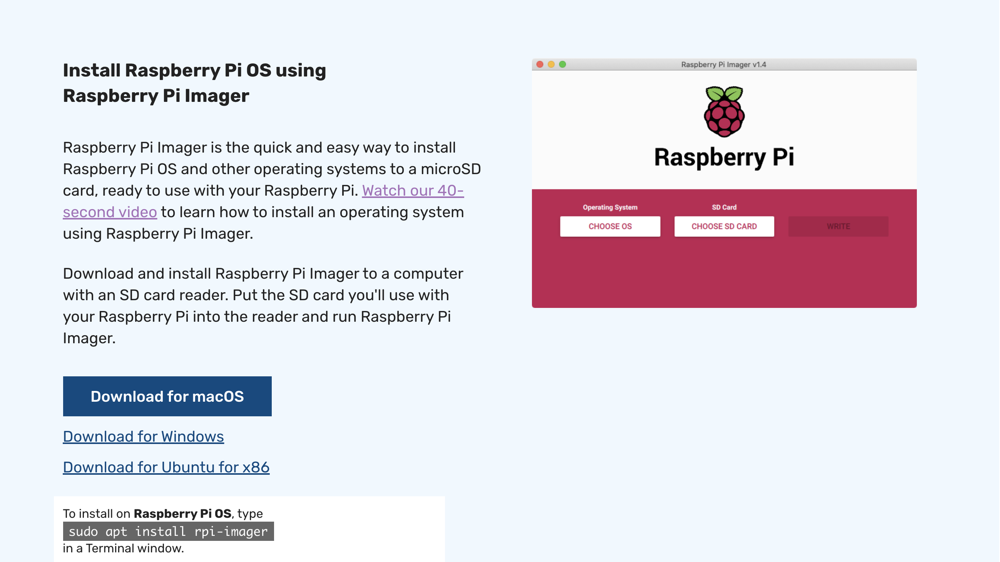
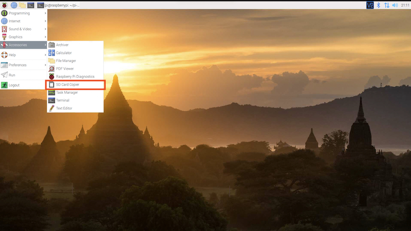
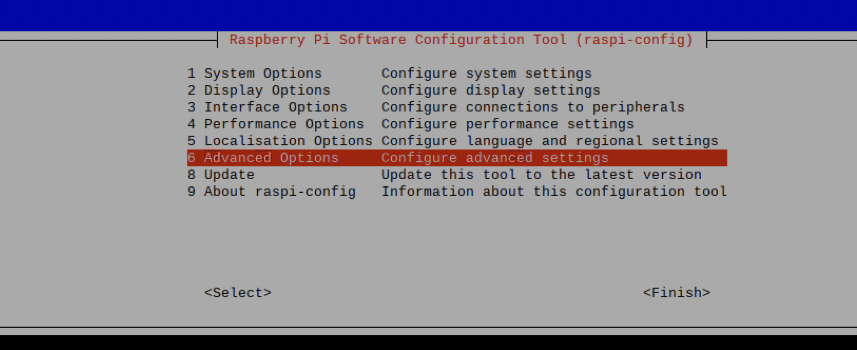

# Raspberry Pi:n käyttöönotto

## Lyhyesti <a id="h.vrhvb96nxxe9"></a>

1. Lataa käyttöjärjestelmä \(OS\). Tässä ohjeessa, Raspberry Pi:n omaa käyttöjärjestelmää \(Raspberry Pi OS\).
2. Asenna Raspberry Pi OS Raspberry Pi Imagerin avulla 
3. Asenna käyttöjärjestelmä SD kortille
4. Käynnistä Pi kortilta ja määritä asetukset
5. Liitä SSD ja kopioi SD kortti SSD:lle
6. Sammuta laite ja  käynnistä uudelleen SSD:ltä



### ÄLÄ HYPPÄÄ VAIHEIDEN YLI


### **Osa 1:**

### Raspberry Pi Debian "buster" OS asentaminen <a id="h.lpv6ciisjqp3"></a>

Lataa viimeisin virallinen versio käyttöjärjestelmästä Raspberry Pi 64bit Debian OS. Tämä on virallinen Raspberry Pi:lle ja ARM64 CPU:lle suunniteltu 64bit Linux käyttöjärjestelmä, joten järjestelmä on hyvin vakaa ja helpottaa Raspberry Pin käyttöönottoa.

**1. Lataa Debian “buster” Raspberry Pi 64bit OS image** [**täältä**](https://downloads.raspberrypi.org/raspios_arm64/images/raspios_arm64-2020-08-24/2020-08-20-raspios-buster-arm64.zip) **ja tallenna se toistaiseksi tietokoneellesi kätevästi saataville.**

**2. Seuraavaksi, lataa Raspberry Pi Imager ohjelma, jota käytetään asentamaan   yllä mainittu käyttöjärjestelmä Raspberry Pi:lle. Ohjelma on saatavilla** [**Raspberry Pi** ](https://www.raspberrypi.org/software/)**verkkosivuilta. Tarkasta, että lataat koneellesi oikean version.**



 **3. Aseta SD kortti tietokoneeseesi ja avaa "Raspberry Pi Imager".**

*  **Klikkaa "CHOOSE OS" ja etsi koneeltasi "2020-08-20-raspios-buster-arm64.zip" tiedosto, jonka latasit kohdassa \(1\) ja valitse se.** 
* **Seuraavaksi, klikkaa "CHOOSE SD" ja etsi SD kortti, jonka asetit koneeseesi**  
* **"WRITE" nappula ilmestyy ja painamalla sitä aloitat käyttökärjestelmän asennuksen SD kortille.** 
* **Lopuksi, kun kirjoitusprosessi on valmis, näet pop-up ikkunan, joka kertoo että käyttöjärjestelmä on asennettu onnistuneesti SD kortille. Klikkaa "CONTINUE" ja poista SD kortti tietokoneesta.** 


#### **Mikäli ohjeiden seuraaminen ei jostai syystä onnistunut,** [**täällä**](https://www.youtube.com/watch?v=J024soVgEeM) **on lyhyt opasvideo yllä kuvatusta prosessista.**


### Osa 2:

### Raspberry Pi järjestelmäasetukset

Ensimmäiseksi haluamme tietenkin käynnistää Raspberry Pi tietokoneemme ja asettaa haluamamme järjestelmäasetukset.

Tätä varten valmistelemamme SD kortti asetetaan Raspberry Pin pohjassa olevaan asemaan. Seuraavaksi kiinnitetään HDMI kaapeli, näppäimistö, hiiri ja virtalähde.

Kun Raspberry Pin käynnistys on valmis ja Raspberry Pi OS työpöytä on näkyvillä voimme aloittaa asetusten määrittämisen.


Mikäli tämä on ensimmäinen kerta kun käynnistät Raspberry Pi koneesi, seuraa käyttöön oton ohjeita alla.


* [ ] Ensin, vaihda koneen käyttäjätunnuksesi ja salasanasi. Näin turvaat laitteesi, evätkä oletustunnukset ole enää käytössä.
* [ ] Liity omaan Wifi verkkoosi \(**voit ohittaa tämän, jos käytät Ethernet yhteyttä**\)
* [ ] Aseta paikallinen aikavyöhykkeesi
* [ ] Valitse kieli ja näppäimistöasetukset
* [ ] Päivitä Raspberry Pi \(ohita tämä, jos haluat päivittää laitteen terminaalin kautta\)


#### Näiden ensiasetusten jälkeen on aika asettaa Raspberri Pi käynnistymään USB portin kautta, jotta voit käyttää ulkoista SSD kovalevyäsi. 


### Osa 3:

### Pi:n käynnistäminen USB:n kautta

**Tämä onkin jo käyttöönotto-oppaan viimeinen osio. Ensin ulkoinen SSD kovalevy liitetään sinisellä merkittyyn USB 3.0 porttiin.**  


Open the Raspberry Pi applications menu and then click on the **SD Card Copier** application.



Then we want to select **COPY FROM DEVICE** - **\(mmcblk0\) SD CARD.**

Next, select **COPY TO DEVICE - \(sda\) SSD Device.**

Once the copy process is complete open a new terminal window and enter the following command.

```text
sudo raspi-config
```

This will bring you to the Raspberry Pi's system configuration settings where you can access the **Advanced Options.**



Next select **Boot Order.**


\*\*\*\*

Then choose the **USB Boot**.


Now you can select **&lt;Ok&gt;** then **&lt;Finish&gt;**, close the Raspberry Pi system configuration menu, and reboot the Pi.

You should now be able to shut down the Pi after it reboots up, remove the SD Card, then you can power up the Pi and it should boot from your external USB storage device.


#### Now that we have finished most of the initial set-up we can continue getting the Pi ready and move to the next [tutorial](tutorial-2-relaynode.md).


#### 


