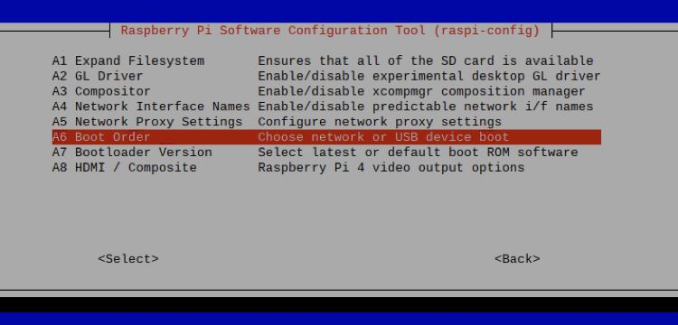
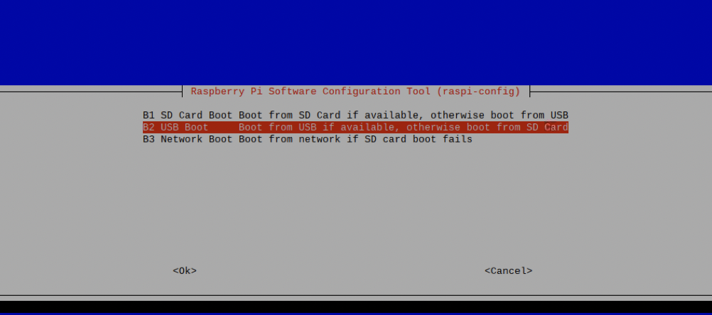

# Setting up the Raspberry Pi

## Summary <a id="h.vrhvb96nxxe9"></a>

1. Download an Operating system \(OS\). For this tutorial, we will be using the Raspberry Pi OS.
2. Install Raspberry Pi OS using Raspberry Pi Imager
3. Flash the OS onto the SD card
4. Boot up the Pi and configure the settings
5. Insert external SSD and copy the SD card to it
6. Shutdown and reboot from SSD


### DON’T SKIP STEPS


### **Part One:**

### Installing the Raspberry Pi Debian "buster" OS <a id="h.lpv6ciisjqp3"></a>

We are going to now download the latest official release of Raspberry Pi 64bit Debian OS. This is the official Linux 64bit OS distribution that is designed for the Raspberry Pi and its ARM64 CPU. This makes it stable and very easy to get started with the Raspberry Pi.

**1. Download the Debian “buster” Raspberry Pi 64bit OS image** [**here**](https://downloads.raspberrypi.org/raspios_arm64/images/raspios_arm64-2020-08-24/2020-08-20-raspios-buster-arm64.zip) **and save it in an accessible location for now on your computer.**

**2. Next, download the Raspberry Pi Imager software that we will use in order to install the OS onto our Raspberry Pi. This software is located on the** [**Raspberry Pi website**](https://www.raspberrypi.org/software/)**. Please download the correct version for your computer.**


**3. Insert the SD card into your computer and open the "Raspberry Pi Imager".**

* **Click on "CHOOSE OS"  then find the "2020-08-20-raspios-buster-arm64.zip" file you have downloaded in step \(1\) of this tutorial and select it.**
* **Next, click on the "CHOOSE SD" and find the SD card you inserted into the computer**
* **Now, the "WRITE" button will appear and you can click on it to begin writing/verifying the OS onto the SD card.**
* **Finally, once it has finished the writing/verifying process, you will see a pop-up window saying that the OS was successfully written to the SD card, click "CONTINUE" and remove your SD card from the computer.**


#### **If you still have issues following the written instructions,** [**here**](https://www.youtube.com/watch?v=J024soVgEeM) **is a short video of this process.**


### Part 2:

### Configuring the Raspberry Pi

The first thing that we want to do is get the Raspberry Pi booted up and configured for our use.

To do this we will need to insert the SD card we flashed earlier with the Raspberry Pi OS into the bottom of the Raspberry Pi. Then we can insert our HDMI, Keyboard, Mouse, and power supply.

Once the Raspberry Pi startup screen is finished and you have booted into the Raspberry Pi OS Desktop screen we can now begin to set up our Raspberry Pi configuration and settings.


If this is your first time booting up the Raspberry Pi OS you will have to follow some initial configurations listed below


* [ ] First, you need to change the Raspberry Pi's Hostname and Password, this will make sure you are not just running the basic login information.
* [ ] Enter Wifi login information \(**you** **may** **skip this if you are using Ethernet**\)
* [ ] Set your local time zone.
* [ ] Choose language and keyboard settings.
* [ ] Update Raspberry Pi \(skip this if you want to update via command line\)


#### After you are done with these initial setup steps, it is time to proceed to get the Rasberry Pi to boot from its USB so that way we can use our external SSD.


### Part 3:

### Getting the Pi to Boot from USB

**This is the final step in this tutorial. We are going to first insert our external SSD into one of the USB 3.0 slots marked blue.**


Open the Raspberry Pi applications menu and then click on the **SD Card Copier** application.


Then we want to select **COPY FROM DEVICE** - **\(mmcblk0\) SD CARD.**

Next, select **COPY TO DEVICE - \(sda\) SSD Device.**

Once the copy process is complete open a new terminal window and enter the following command.

```text
sudo raspi-config
```

This will bring you to the Raspberry Pi's system configuration settings where you can access the **Advanced Options.**


Next select **Boot Order.**



\*\*\*\*

Then choose the **USB Boot**.



Now you can select **&lt;Ok&gt;** then **&lt;Finish&gt;**, close the Raspberry Pi system configuration menu, and reboot the Pi.

You should now be able to shut down the Pi after it reboots up, remove the SD Card, then you can power up the Pi and it should boot from your external USB storage device.


#### Now that we have finished most of the initial set-up we can continue getting the Pi ready and move to the next [tutorial](tutorial-2-relaynode.md).


